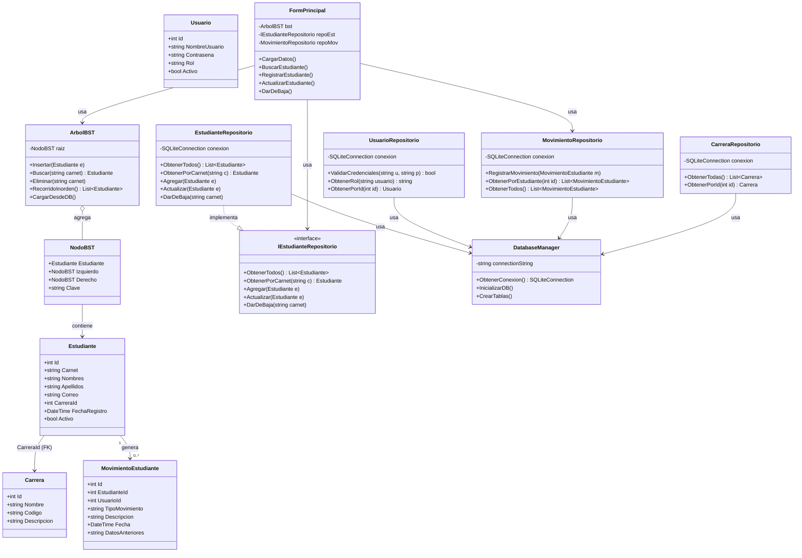
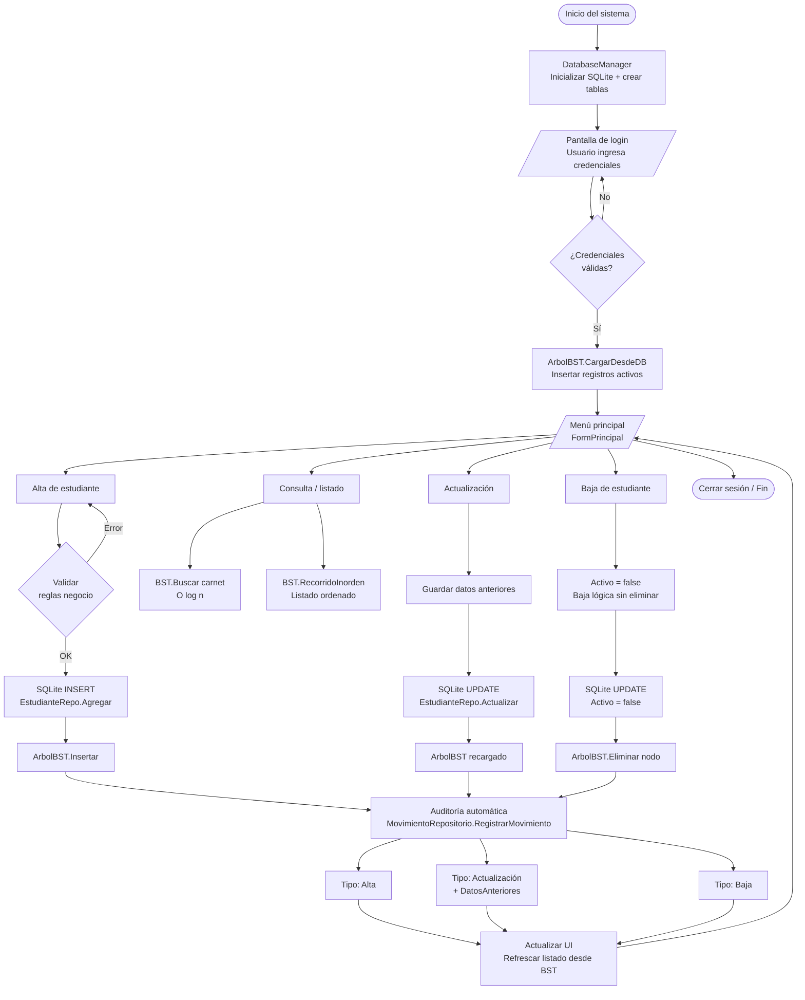
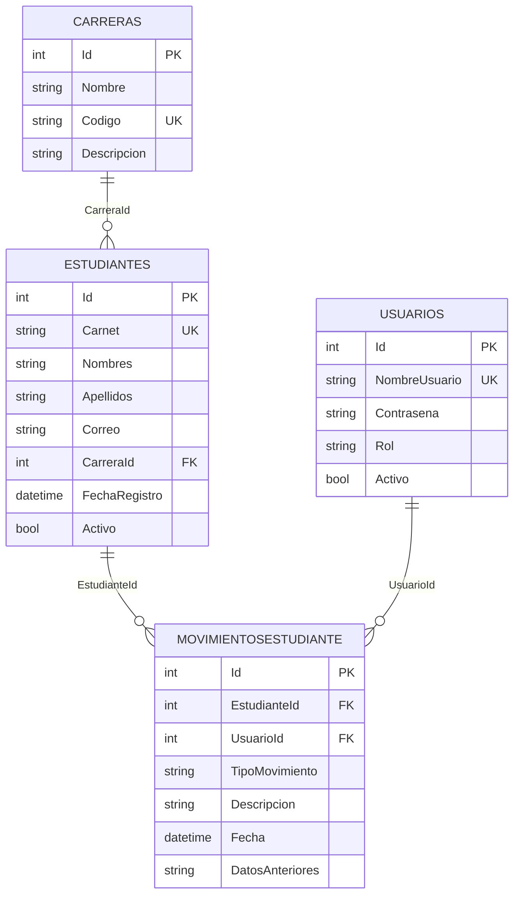

# 📚 Diagrama UML y descripcion de los modulos

[](UDB_horizontal.png)

---

## 1. Descripción general de la Fase 2

En la Fase 2 se amplió significativamente el sistema incorporando **persistencia real de datos** mediante SQLite, un **patrón de repositorios** para desacoplar el acceso a datos de la lógica de presentación, y un módulo de **auditoría automática** que registra cada operación sobre los estudiantes con fecha, usuario responsable y datos anteriores.

El árbol BST de la Fase 1 se mantiene como estructura central de ordenamiento en memoria, pero ahora se **carga desde la base de datos** al iniciar sesión y se **sincroniza** con cada operación CRUD.

### Mejoras respecto a la Fase 1

| Aspecto | Fase 1 | Fase 2 |
|---|---|---|
| Persistencia | Solo en memoria (BST) | SQLite con 4 tablas relacionales |
| Acceso a datos | Directo desde UI | Patrón Repositorio (interfaz + implementación) |
| Autenticación | Sin control | Login con roles (Administrador / Operador) |
| Auditoría | Sin trazabilidad | Tabla `MovimientosEstudiante` automática |
| Baja de registros | Eliminación física | Baja lógica (`Activo = false`) |
| Ordenamiento | BST manual | BST cargado desde DB + índices SQL |

---

## 2. Descripción de módulos y funcionalidades

### 2.1 Capa de presentación — Windows Forms

#### `FormLogin`
Pantalla de inicio del sistema. Recibe usuario y contraseña, delega la verificación al `UsuarioRepositorio` y, si las credenciales son válidas, abre `FormPrincipal` pasando el usuario y rol activos. Bloquea el acceso si las credenciales son incorrectas y muestra mensaje de error.

#### `FormPrincipal`
Núcleo de la interfaz. Al abrirse llama a `ArbolBST.CargarDesdeDB()` para poblar el árbol con todos los registros activos. Desde aquí el operador puede:
- **Registrar** un nuevo estudiante (con validaciones de negocio)
- **Buscar** por carnet usando `ArbolBST.Buscar()` — O(log n)
- **Editar** datos de un estudiante existente
- **Dar de baja** de forma lógica sin eliminar el registro

El listado principal se obtiene del **recorrido inorden** del BST, garantizando orden ascendente por carnet sin necesidad de `ORDER BY` en SQL.

#### `FormMovimientos`
Muestra el historial completo de auditoría. Permite filtrar por estudiante o por tipo de movimiento (Alta, Actualización, Baja). Consume `MovimientoRepositorio.ObtenerTodos()` y `ObtenerPorEstudiante()`.

#### `FormCarreras`
Administra el catálogo de carreras disponibles. Todo estudiante debe estar vinculado a una carrera existente mediante clave foránea, por lo que este módulo es prerequisito para el registro de estudiantes.

---

### 2.2 Capa de lógica de negocio — Árbol Binario de Búsqueda (BST)

#### `ArbolBST`
Estructura central de ordenamiento en memoria. Usa el **carnet** como clave de comparación. Provee:

| Método | Complejidad | Descripción |
|---|---|---|
| `Insertar(Estudiante)` | O(log n) prom. | Inserta un nodo respetando la propiedad BST |
| `Buscar(carnet)` | O(log n) prom. | Búsqueda directa por clave |
| `Eliminar(carnet)` | O(log n) prom. | Elimina el nodo del árbol en memoria |
| `RecorridoInorden()` | O(n) | Devuelve lista ordenada ascendente |
| `CargarDesdeDB()` | O(n log n) | Inserta todos los registros activos de SQLite |

#### `NodoBST`
Representa cada nodo del árbol. Contiene la referencia al objeto `Estudiante` completo, más punteros al subárbol izquierdo y derecho.

#### Reglas de negocio aplicadas antes de persistir
- **Carnet único:** verificado contra la DB y contra el BST en memoria.
- **Campos obligatorios:** carnet, nombres y apellidos no pueden estar vacíos.
- **Carrera obligatoria:** el `CarreraId` debe corresponder a un registro existente en la tabla `Carreras`.
- **Baja lógica:** nunca se elimina físicamente un registro; se establece `Activo = false`.

---

### 2.3 Capa de acceso a datos — Patrón Repositorio

#### `IEstudianteRepositorio` _(interfaz)_
Define el contrato CRUD para estudiantes. Desacopla la UI de los detalles de SQLite y permite sustituir la implementación sin modificar capas superiores.

```csharp
interface IEstudianteRepositorio {
    List<Estudiante> ObtenerTodos();
    Estudiante ObtenerPorCarnet(string carnet);
    void Agregar(Estudiante e);
    void Actualizar(Estudiante e);
    void DarDeBaja(string carnet);
}
```

#### `EstudianteRepositorio`
Implementa `IEstudianteRepositorio` usando `SQLiteConnection`. Ejecuta `INSERT`, `SELECT`, `UPDATE` y la baja lógica sobre la tabla `Estudiantes`.

#### `UsuarioRepositorio`
Valida credenciales comparando usuario y contraseña almacenados. Retorna el rol del usuario (`Administrador` / `Operador`), que controla qué operaciones están habilitadas en la UI.

#### `MovimientoRepositorio`
Registra automáticamente cada operación con:
- Tipo de movimiento: `Alta`, `Actualización` o `Baja`
- Fecha y hora exactas
- ID del usuario que realizó la operación
- Datos anteriores del registro (para actualizaciones)

#### `CarreraRepositorio`
Provee el catálogo de carreras disponibles para poblar el selector en `FormPrincipal` y `FormCarreras`.

---

### 2.4 Capa de infraestructura — `DatabaseManager`

Encapsula la cadena de conexión a SQLite y provee los métodos `ObtenerConexion()`, `InicializarDB()` y `CrearTablas()`. Se ejecuta al iniciar la aplicación y garantiza que las tablas, índices y restricciones existan antes de cualquier operación.

---

## 3. Diagrama UML de clases

> Las clases se agrupan por color: **púrpura** = entidades/modelos, **verde azulado** = estructura BST, **coral** = repositorios, **gris** = infraestructura DB, **azul** = presentación.



---

## 4. Diagrama de flujo de procesos principales



---


    subgraph LOGICA["🌳  Capa de lógica de negocio — BST + Reglas"]
        BST[ArbolBST\nInsertar · Buscar · Inorden]
        NODO[NodoBST\nClave = carnet]
        RN[Reglas de negocio\nCarnet único · Baja lógica\nCampos obligatorios]
    end

    subgraph REPOSITORIOS["📦  Capa de acceso a datos — Patrón Repositorio"]
        IFACE[«interface»\nIEstudianteRepositorio]
        ER[EstudianteRepositorio\nINSERT · SELECT · UPDATE]
        UR[UsuarioRepositorio\nValidar credenciales · Rol]
        MR[MovimientoRepositorio\nRegistrar auditoría]
        CR[CarreraRepositorio\nCatálogo carreras]
    end

    subgraph PERSISTENCIA["🗄️  Capa de persistencia — SQLite"]
        DM[DatabaseManager\nConexión · Inicialización]
        TB_EST[(Estudiantes\ncarnet UNIQUE · Activo)]
        TB_CAR[(Carreras\nCódigo único)]
        TB_USR[(Usuarios\nRol CHECK)]
        TB_MOV[(MovimientosEstudiante\nTipoMovimiento CHECK)]
    end

    FL --> UR
    FP --> BST
    FP --> IFACE
    FP --> MR
    FP --> RN
    FM --> MR
    FC --> CR

    BST o-- NODO
    IFACE <|.. ER

    ER --> DM
    UR --> DM
    MR --> DM
    CR --> DM

    DM --- TB_EST
    DM --- TB_CAR
    DM --- TB_USR
    DM --- TB_MOV

    TB_EST -- "FK CarreraId" --> TB_CAR
    TB_MOV -- "FK EstudianteId" --> TB_EST
    TB_MOV -- "FK UsuarioId" --> TB_USR
```

---

## 6. Base de datos y reglas de integridad

### Esquema relacional



### Restricciones implementadas

| Tabla | Restricción | Tipo |
|---|---|---|
| `Estudiantes` | `Carnet` sin duplicados | `UNIQUE` |
| `Estudiantes` | `CarreraId` referencia a `Carreras.Id` | `FOREIGN KEY` |
| `Estudiantes` | `Activo` controla baja lógica | `DEFAULT 1` |
| `Usuarios` | `Rol IN ('Administrador','Operador')` | `CHECK` |
| `MovimientosEstudiante` | `TipoMovimiento IN ('Alta','Actualización','Baja')` | `CHECK` |
| `MovimientosEstudiante` | `EstudianteId` → `Estudiantes.Id` | `FOREIGN KEY` |
| `MovimientosEstudiante` | `UsuarioId` → `Usuarios.Id` | `FOREIGN KEY` |

### Índices creados

```sql
CREATE INDEX idx_carnet             ON Estudiantes(Carnet);
CREATE INDEX idx_carrera            ON Estudiantes(CarreraId);
CREATE INDEX idx_movimiento_est     ON MovimientosEstudiante(EstudianteId);
CREATE INDEX idx_movimiento_tipo    ON MovimientosEstudiante(TipoMovimiento);
```

---

## 7. Tecnologías utilizadas

| Tecnología | Versión | Uso |
|---|---|---|
| C# | .NET 8 | Lenguaje principal |
| Windows Forms | .NET 8 | Interfaz gráfica |
| SQLite | 3.x | Base de datos local |
| Microsoft.Data.Sqlite | NuGet | Driver de acceso a SQLite |
| Visual Studio | 2022 | IDE de desarrollo |
| Git / GitHub | — | Control de versiones |

---

> **Nota:** Los diagramas Mermaid se renderizan automáticamente en GitHub. Para visualizarlos localmente se puede usar la extensión *Markdown Preview Mermaid Support* en VS Code.
